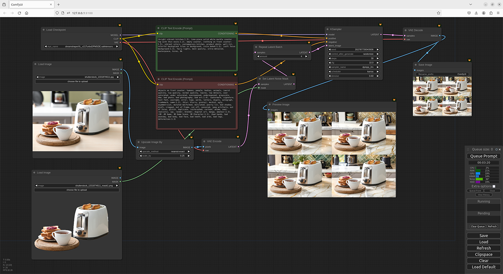
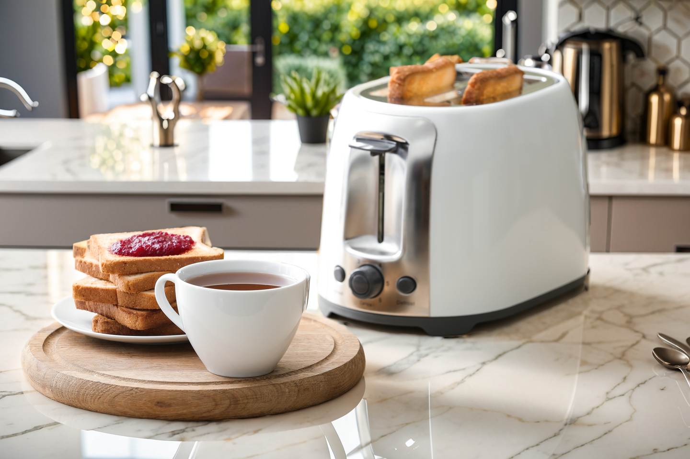
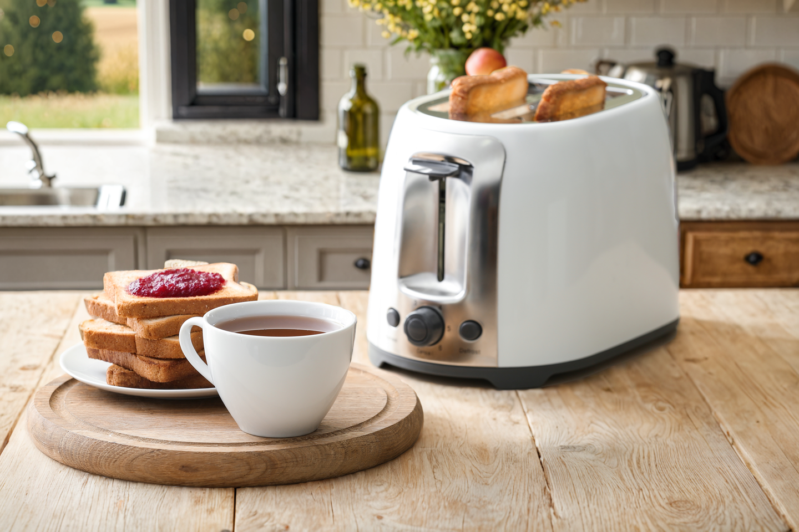
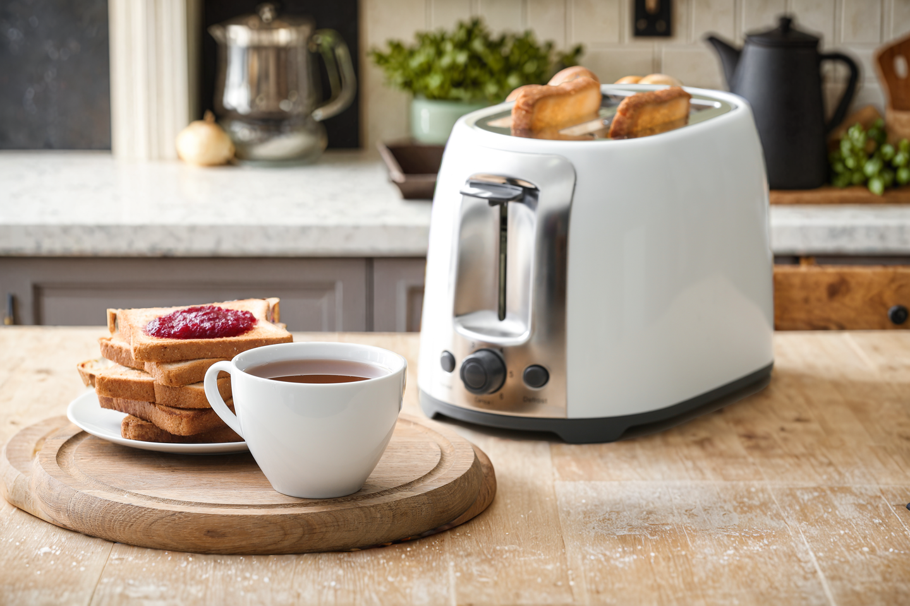
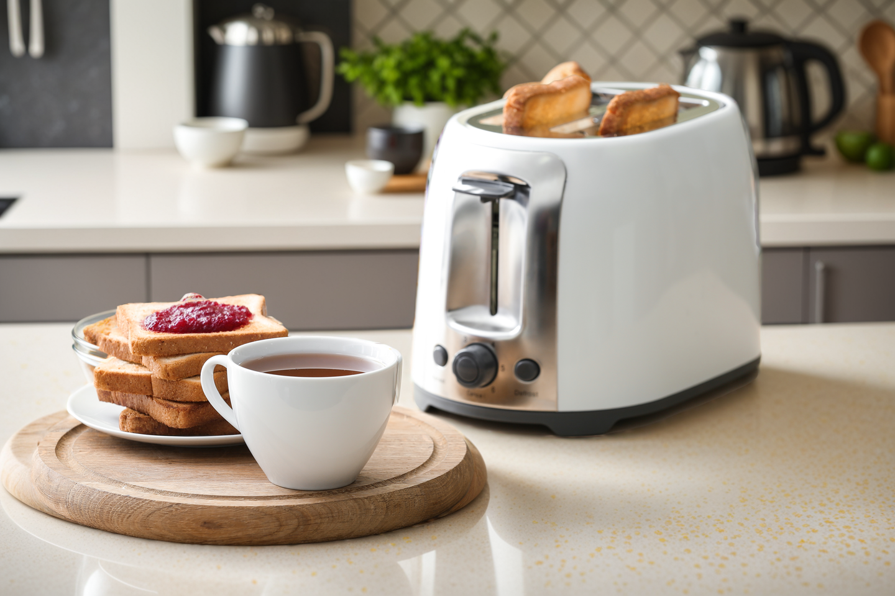
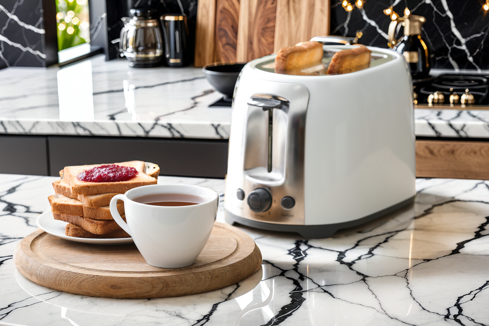
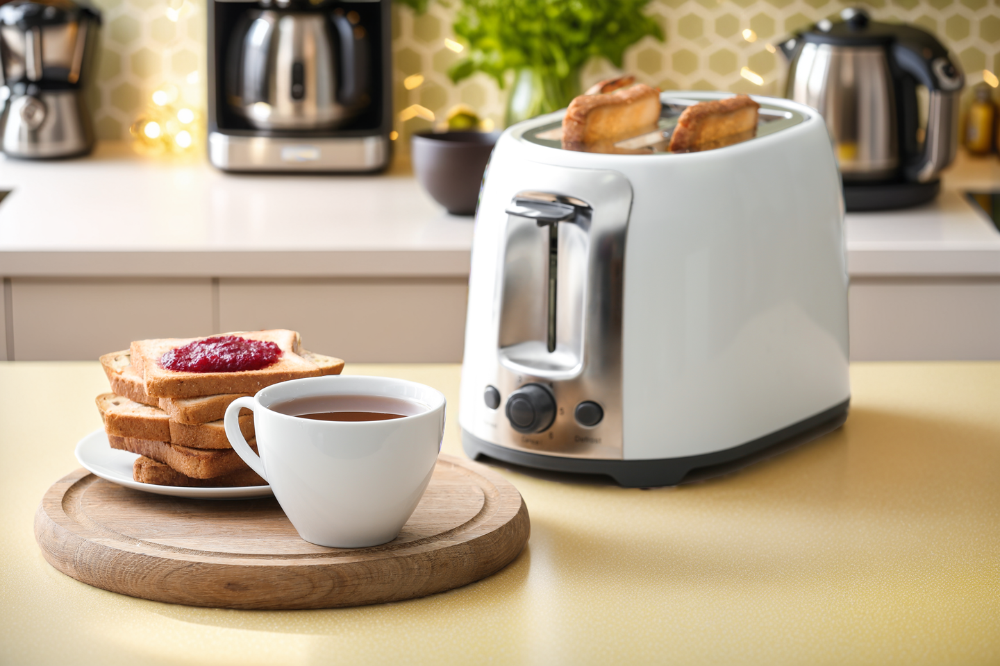
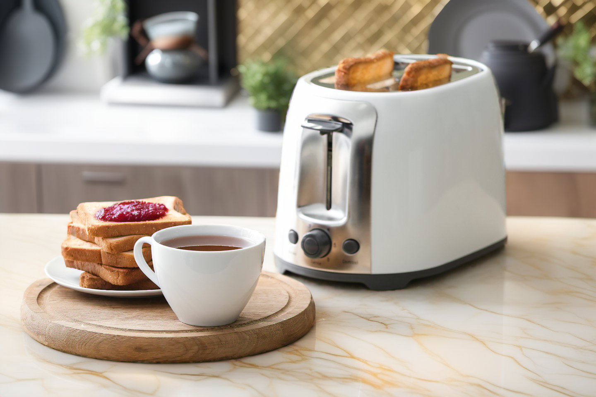
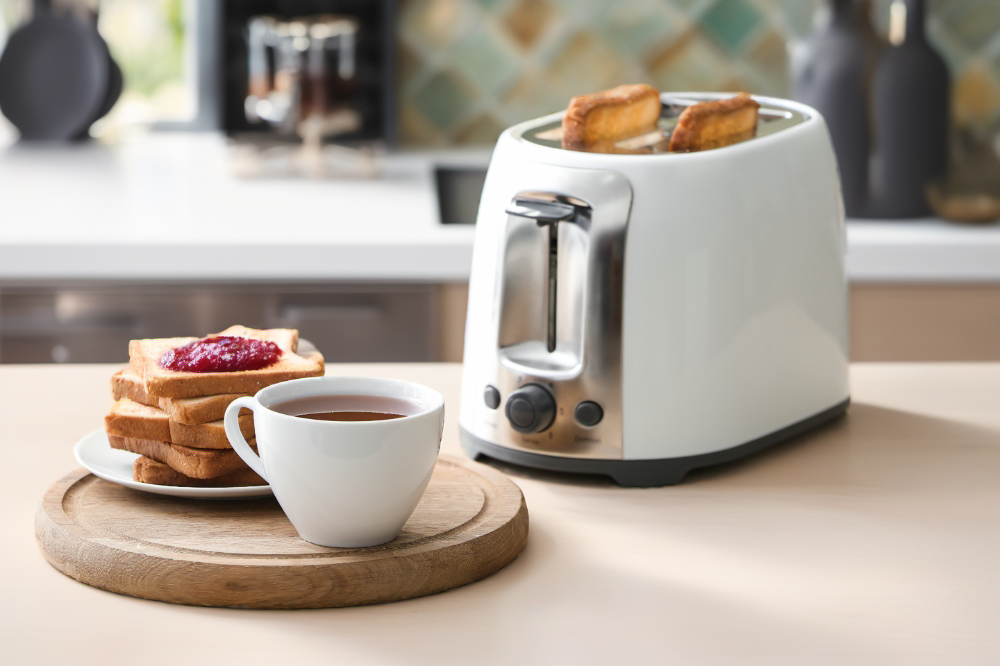

# ComfyUI Image Variations with a Mask Demo

ComfyUI workflow for generating multiple image variations from an image with a mask. Uses Stability AI's Stable Diffusion XL (SDXL) foundation model or similar fine-tuned models.

## Sample Images

<table>
   <tr>
      <td></td>
      <td></td>
   </tr>
   <tr>
      <td></td>
      <td></td>
   </tr>
   <tr>
      <td></td>
      <td></td>
   </tr>
   <tr>
      <td></td>
      <td></td>
   </tr>
   <tr>
      <td></td>
      <td></td>
   </tr>
</table>
